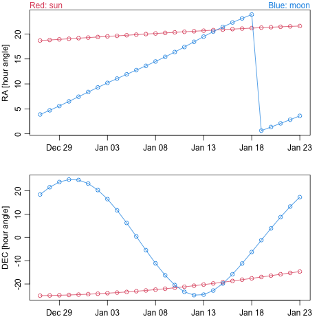

# Ephemeris downloader

## Overview

`eph.R` is an R script to download and plot Ephemeris data from a server.  The
query used for the download is constructed from only a cursory glance at the
rather extensive documentation (see Resource 1), and so this is really quite
limited.

## Installation

`epheremis` is not on CRAN, but may be installed with
```R
remotes::install_github("dankelley/ephemeris")
```

## Example

The example
```R
library(epheremis)
example(epheremis)
```
produces the following.


## Limitations and Bugs

1. The time step must be in integral days. (In theory we can give e.g. `"1 h"`
   but that seems to fail in my tests.)

# Resources

1. https://ssp.imcce.fr/webservices/miriade/api/ephemcc/

